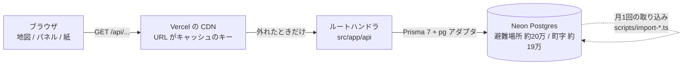
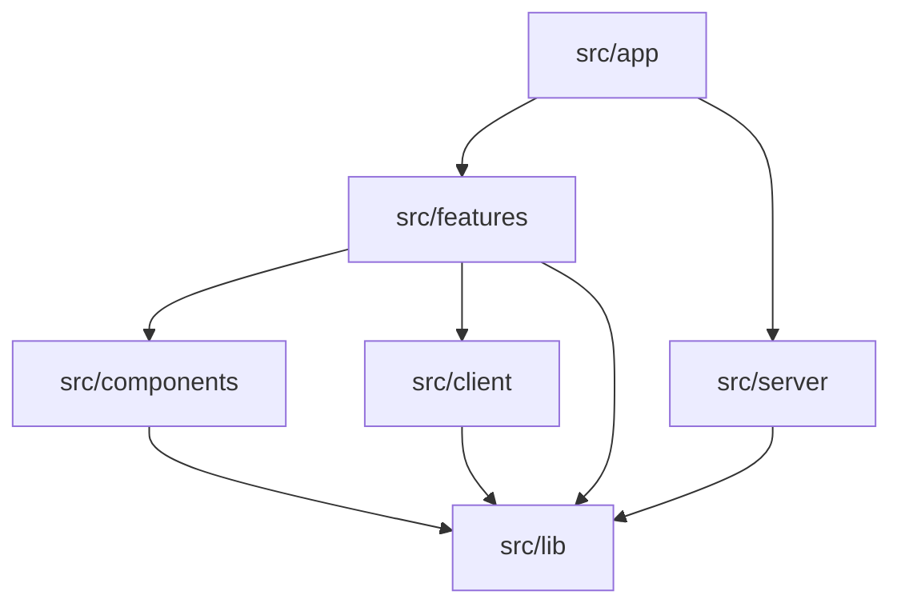
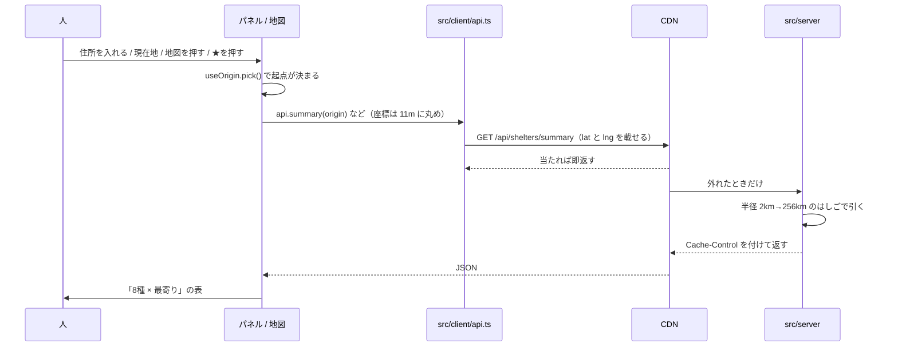
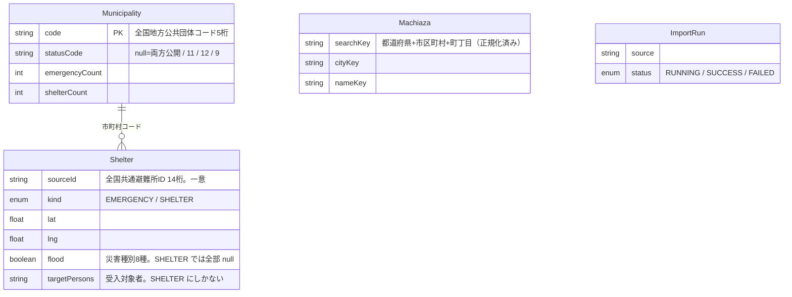

# アーキテクチャ

このファイルは「**どこに何があって、どう繋がっているか**」の地図です。
「**なぜそう決めたか**」は [DECISIONS.md](./DECISIONS.md) に16項目ぶん
書いてあるので、ここでは繰り返さず、必要なところから参照します。

- 読む順：全体像 → 層 → リクエストの流れ → 守っている不変条件
- 手を入れる前に見るなら、いちばん下の「変更するときの入口」から

---

## 全体像



要点は3つです。

1. **読み取り専用。** ログインもクッキーも書き込みもありません。だから応答をまるごと CDN に置けます
2. **拠点（自宅・職場）はサーバーに行きません。** URL のフラグメント（`#s=...`）に持つので、
   リクエスト行にも Vercel のアクセスログにも自宅の座標が残りません（[判断8](./DECISIONS.md#d8)）
3. **速さの本体はキャッシュです。** 同じクエリがローカル 45〜57ms に対して本番
   （Vercel sin1 → Neon ap-southeast-1）で 458〜668ms、スリープ復帰で約2.2秒。
   差の大半は往復と復帰なので、そこを飛ばすのがいちばん効きます

---

## 層 ―― 置き場所が「どこで動くか」を表す

| 置き場所 | 動く場所 | 中身 |
|---|---|---|
| `src/lib` | どこでも | 災害8種・種別・格子の吸着・**API の型**・拠点の値・起点 |
| `src/client` | ブラウザだけ | fetch の口・URL と localStorage・小さなフック |
| `src/server` | サーバーだけ | Prisma のクエリ・キャッシュヘッダ・引数の読み取り |
| `src/features` | 画面 | `map` / `panel` / `places` |
| `src/components` | 画面 | どの画面からも使う土台（Modal・QrCode・SiteFooter・IntroCard） |
| `src/app` | ルーティング | `page` / `layout` / `route` / メタデータのみ |

### 依存は一方通行



**`src/features` と `src/client` から `src/server` へは引かない**、が唯一守るべき向きです。

以前は純粋な関数と Prisma を引く関数が同じ `src/lib` にいて、それを守っていたのは
各ファイル冒頭の「Prisma を持ち込まないこと」というコメントだけでした。画面側は
`import type` でそこへ手を伸ばしており、型は消えるので動きはします。
ただし**値をひとつ import した瞬間に Prisma がブラウザのバンドルに入ります**。
コメントで守るのをやめて、置き場所で守っています。

確かめ方（どちらも0件であること）:

```bash
# 画面やブラウザ側が DB 層を読んでいないか
grep -rn "@/server/" src/features src/client src/lib src/components
# ビルド後のクライアントチャンクに Prisma が入っていないか
grep -rl "PrismaClient" .next/static/
```

> `server-only` パッケージを入れれば、違反した時点でビルドが落ちます。
> まだ依存に入れていないので、いまは置き場所の規約と上の grep で守っています。

### `src/lib` に型だけのファイルがある理由

`src/lib/shelter.ts` は**公開 API がやりとりする形（型）だけ**を持ちます。
作る側（`src/server`）と読む側（`src/client`・画面）が同じ型を見ながら、
実装には触れられない状態を作るためです。

---

## 画面の構造（`src/features`）

```
features/
  map/      地図そのもの
    ShelterMap.tsx       組み立て役。state を繋いで、React の外（地図・マーカー）に反映する
    map-style.ts         MAP_STYLE・レイヤー定義・色・ズームの段（見た目の単一の出どころ）
    markers.ts           ピン / 拠点の印 / 現在地の印（DOM で描く。地理院タイルはラスタで symbol が使えない）
    camera.ts            パネルに隠れない位置へ寄せる・広い画面の境目（768px）
    interactions.ts      地図を押したときの意味（点なら詳細、そうでなければ起点 or 拡大）
    shelter-source.ts    見えている範囲が変わるたびの取得と、点 / クラスタの状態
    use-origin.ts        起点・見ている面・選択・「元に戻す」をまとめて持つ
    use-geolocation.ts   現在地
    MapChips.tsx         地図に重ねる状態（件数 / 絞り込み中 / 読み込み中）。操作は置かない
    LocateButton.tsx     現在地ボタン（パネルの状態に左右されない場所に置く）
    UrlPlacesPrompt.tsx  URL の拠点と端末の拠点が食い違ったときの3択
  panel/    操作と結果のパネル（狭い画面は下のシート、広い画面は左の柱）
    ShelterPanel.tsx     枠だけ。中身は下の4つが自分で取得する
    SummaryTable.tsx     災害別の表（このアプリの答え）
    NearbyList.tsx       近い順（表の裏取り）
    DetailPane.tsx       1件の詳細
    EmptyState.tsx       起点がまだ無いときの案内
    ShelterFilterBar.tsx / AddressSearch.tsx / ShelterDetailView.tsx / parts.tsx
  places/   拠点の保存・共有・印刷
    SavePlaceDialog.tsx / ShareSheet.tsx / PrintSheet.tsx
```

`ShelterMap.tsx` が抱えるのは「繋ぎ」と effect だけで、MapLibre の面倒と起点の
state はそれぞれ別のファイルにあります。**地図は一度しか作らない**ので、
イベントに渡すハンドラと絞り込みは控え（ref）越しに読みます
（直接渡すとその時点の関数を永久に掴み、依存が増えた日に黙って壊れます）。

---

## リクエストの流れ



取得の3状態（読み込み中 / 失敗 / 結果）は `src/client/use-resource.ts` に1つだけあります。
**URL が変わったら前の結果は出しません**。以前は呼ぶ側が `key` を付けて部品ごと
作り直していましたが、作り直す単位（起点だけ／起点＋絞り込み）は結局 URL そのものでした。

---

## API

| ルート | 返すもの | 呼ぶ側 |
|---|---|---|
| `GET /api/shelters` | 表示範囲の点、多すぎればクラスタ | 地図（`shelter-source.ts`） |
| `GET /api/shelters/nearby` | 起点から近い順 | 近い順の一覧 |
| `GET /api/shelters/summary` | 「8種 × 最寄り」＋指定避難所1件 | 災害別の表・紙 |
| `GET /api/shelters/[sourceId]` | 1つの指定の中身 | 点を押したとき・行を開いたとき |
| `GET /api/geocode` | 住所（町丁目）の候補 | 住所検索 |

引数の読み取りは `src/server/params.ts`（bbox・lat/lng・limit・cells）と
`src/lib/filter.ts`（kinds・disaster・welfare）に分かれています。
絞り込みだけ `src/lib` にあるのは、**書く側（ブラウザ）と同じファイルに置くため**です。

`bbox` だけが不正なら 400、それ以外は既定に落とします（地図が出ないほうが損なので）。
失敗の応答はキャッシュしません（`no-store`）。

---

## キャッシュ ―― 効きは全部 URL に乗っている

CDN は URL をキーにするので、**同じ問い合わせが同じ文字列にならないと1件も当たりません**。
そこで、送る前に取りうる URL の数を絞っています。

| 何を | どう丸めるか | どこ |
|---|---|---|
| 表示範囲 | 幅の 1/8 の格子に**外側へ**吸着（内側だと画面の縁が削れる） | `lib/geo.ts` `snapBbox` |
| クラスタの分割数 | 2の冪に寄せる（画面幅の種類だけ URL が分かれるのを防ぐ） | `lib/geo.ts` `snapCells` |
| 起点の座標 | 小数4桁 ≒ 11m（最寄りの順位は変わらない） | `lib/geo.ts` `roundCoord` |
| 災害種別の並び | CSV の列順に正規化（8種の順列は最大 40,320 通り） | `lib/disasters.ts` |
| 住所の文字列 | 表記ゆれを寄せる（全角半角・ヶとケ・区切り） | `lib/address.ts` |

**URL を組み立てるのは `src/client/api.ts` だけ**です。呼ぶ側から文字列が見えないので、
丸めや正規化を1か所で書き忘れることがありません。

ヘッダは2段（`src/server/http-cache.ts`）。

```
Cache-Control:     public, max-age=300                                  # ブラウザ。短く
CDN-Cache-Control: public, s-maxage=86400, stale-while-revalidate=604800 # CDN。取り込みは月1
```

効きの本体は `stale-while-revalidate` です。これが無いと、キャッシュが効くほど Neon が暇に
なってスリープし、期限切れに当たった1人だけが復帰の約2.2秒を待つことになります。

---

## 守っている不変条件

壊しても型検査もテストも通り、**画面で静かに嘘をつく**ものを並べます。

### 1. 同じ施設の鍵は「名前＋住所」。3か所で同じ

元データは1行＝1つの指定なので、同じ学校に緊急と避難所の指定があると2行あり、
座標は数十 m ずれます（常盤小学校は住所が同じで 25m）。名前＋住所が一致する組は 46,124、
座標の完全一致だけだと 27,875 で**多数派を取りこぼします**。

| 場所 | 何をしているか |
|---|---|
| `server/shelters.ts` `collapsePoints` | 地図の点を1つにする（＋座標一致でも寄せる） |
| `server/nearby.ts` `mergeSameFacility` | 近い順の行を1つにする |
| `server/shelter-detail.ts` `fetchDetail` | 押した先で、同じ施設の他の指定を引く |

**ここだけ条件が違うと、まとめて出したのに中身が出ない組が生まれます。**
住所だけで寄せないのも決めごとです（「南町中学校（体育館等）」と「南町中学校」は別物）。

### 2. 絞り込みの where 条件を、2つの言語で二重に持っている

集約も距離順も Prisma のクエリでは書けない（式でグループ化・並べ替えができない）ので、
`$queryRaw` を使っています。結果として同じ条件が2か所にあります。

- `server/shelters.ts` の `whereFor` … Prisma のクエリ版（点の取得）
- `server/shelter-query.ts` の `sqlWhereFor` … 生 SQL 版（クラスタ・近い順・表）

**片方を変えたら必ずもう片方も見てください。** 既知の負債で、消せていません。

### 3. 拠点はフラグメント。クエリに移さない

`?s=` にした瞬間、共有 URL を開いただけで自宅の座標がリクエスト行に載り、
ホスティングのアクセスログに残ります。「サーバーに持たない」が崩れます。

### 4. 色とラベルの単一の出どころ

種別の色は `lib/kinds.ts`、災害8種は `lib/disasters.ts` だけが持ちます。
地図の点・凡例・絞り込み・詳細・紙・OG 画像がすべてここを読みます。

### 5. 生 SQL の列並びと Prisma の `select`

`server/shelter-query.ts` の `DETAIL_COLUMNS` と `server/shelter-detail.ts` の
`DETAIL_SELECT` は同じ列を指します。片方に足したら両方に足します。

---

## データモデル



**1行 = 1つの指定**であって、施設ではありません（[判断5](./DECISIONS.md#d5)）。
まとめるのは表示の都合なので、件数は指定の数のまま数えます。

索引でいちばん効いているのはこれです。

```prisma
@@index([lat, lng, kind, flood, ... , volcano, targetPersons], map: "Shelter_bbox_filter_idx")
```

列が多いのは意図的で、**クラスタ集約を Index Only Scan に保つため**です。
lat/lng だけの索引だと、災害種別で絞った瞬間にフラグを読みに heap へ行き、
プランが Seq Scan に倒れます（[判断3](./DECISIONS.md#d3)）。

主な閾値:

| 定数 | 値 | 意味 |
|---|---|---|
| `MAX_POINTS` | 2,000 | これを超えたらクラスタに切り替える（ズームではなく件数で判断） |
| `RADII_M` | 2km → 256km | 近い順・表の半径のはしご。倍々に広げる |
| `NEARBY_LIMIT_M` | 3km | これより遠いものは「近くにありません」として出す |
| `MAX_PLACES` | 6 | URL に載せる拠点の数 |

---

## 意図的にやっていないこと

| やらないこと | 理由 |
|---|---|
| ログイン・ユーザー DB | 拠点は URL に持つ。自宅の位置を預からずに済む |
| 外部ジオコーディング API | 規約の曖昧な依存を入れると、公開の判断がそこだけ戻ってくる |
| PostGIS | 矩形＋ハバサインの式で足りる。拡張の有無に縛られない |
| 状態管理ライブラリ | 正本が URL と localStorage（React の外）なので `useSyncExternalStore` で足りる |
| クラスタの円を地図に描く | 全国の密度は、場所を決める判断にも逃げ先を知る判断にも使われない |
| 番地までの住所 | 町丁目の代表点との差（数百 m）は最寄りの順位をほとんど変えない |

---

## 変更するときの入口

| こうしたい | まず見る場所 |
|---|---|
| 地図の色・点の大きさ・ズームの段を変える | `features/map/map-style.ts` |
| 地図を押したときの挙動を変える | `features/map/interactions.ts` |
| 起点の決まり方・「元に戻す」を変える | `features/map/use-origin.ts` |
| 絞り込みの軸を足す | `lib/filter.ts` → `server/shelter-query.ts` と `server/shelters.ts` の**両方** |
| 災害種別を足す・ラベルを変える | `lib/disasters.ts` → Prisma スキーマの列 → 索引 |
| API を足す | `app/api/**/route.ts` ＋ `lib/shelter.ts`（型）＋ `client/api.ts`（URL） |
| 表の見せ方（束ね方・遠さの判定）を変える | `lib/summary.ts`（画面と紙が共有） |
| キャッシュの長さを変える | `server/http-cache.ts` |
| 取り込みを直す | `scripts/import-gsi.ts` / `scripts/import-isj.ts` |

新しいモジュールを置くときは、**まず「どこで動くか」を決めてから**フォルダを選んでください。
迷ったら `src/lib`（どこでも動く）に置けるかを先に考えると、たいてい素直になります。
